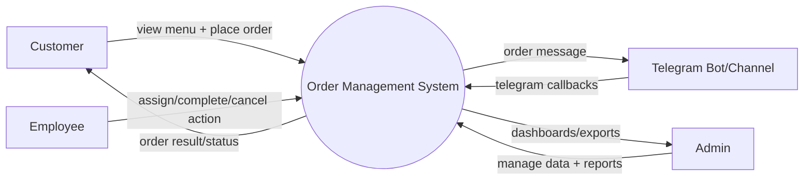
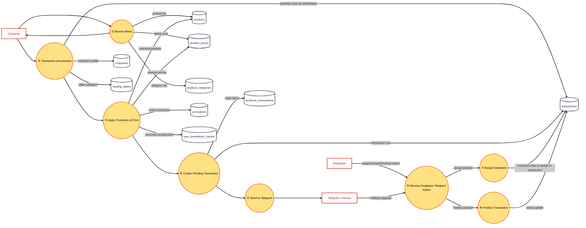

## 1) Context DFD (Very High Level)



## 2) Level 1 DFD (Customer + Employee Order Flow)



## 3) Level 1 DFD (Admin Scope)

```mermaid
flowchart TB
  E1[Admin]
  P0((① Admin Request))
  P1((② Manage Data & Reporting))

  D1[(users)]
  D2[(transactions)]
  D3[(products)]
  D4[(product_categories)]
  D5[(product_prices)]
  D6[(promotions)]
  D7[(employees)]
  D8[(seating_tables)]
  D9[(inventories)]
  D10[(inventory_movements)]

  E1 -->|manage + view/export| P0
  P0 --> P1
  P1 -->|user records + export filters| D1
  P1 -->|transaction records + export range| D2
  P1 -->|product CRUD data| D3
  P1 -->|category CRUD data| D4
  P1 -->|price update history| D5
  P1 -->|promotion rules + status| D6
  P1 -->|employee profile/status| D7
  P1 -->|table setup (table_number,seating_count)| D8
  P1 -->|inventory master (name,note,image)| D9
  P1 -->|inventory movement logs (type,qty,time)| D10

  classDef orderStep fill:#FFE082,stroke:#E65100,stroke-width:2px,color:#000000;
  class P0,P1 orderStep;
```